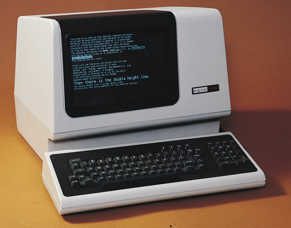

Logistics
===

* We meet Fridays, 13-15h.  Please try to attend in person!
* I will try to remember to record the classes and put them on YouTube
* To email the group: CLUBclub.virologie@charite.de
* Chat using Slack (ask me for an invite) in our `#club-club` channel
* These slides are on GitHub, at https://github.com/VirologyCharite/club-club
* Cluster help: https://git.bihealth.org/charite-sc-public/sc-wiki/-/wikis/home
* Getting a terminal (when on the VPN): https://s-sc-hub.charite.de/

You need to be on the Charité VPN if you're not on the wired Charité
network.

Some motivational words
===

* Using the command line effectively is a big subject, even before we get to bioinformatics
* You have to _do_ things. Don't be passive
* Help each other!
* We are not bioinformatics experts - we're still learning too
* There is a ton of help around online (YouTube, AI)

Course outline
===

There is an assumption that you're all interested in working with
genetic sequences.

Geneious is a _great_ piece of software. But sometimes you'll have
more data or need more processing power than your laptop/desktop can
supply, or you'll need to do something that's not possible in
Geneious, or you simply won't have Geneious at all.

* Command-line basics (today)
* NGS data
* Getting sequences from NCBI (and maybe other databases)
* Mapping reads to references (nucleotide level)
* Mapping reads to references (protein level)
* _De novo_ assembly
* Multiple sequence alignments
* Calling consensuses
* Phylogenetic trees
* Using Claude to write you bioinformatics tools

Most of these conceptually simple tasks are actually very complicated!

Your suggestions?

* Using `git` and GitHub

Today
===

Will be a bit boring. I will cover some basics and get you to type a
few one-time commands to get you fully set up.

You won't actually do anything much until next week.

High-performance compute system (HPCS)
===

* aka a "cluster"
* An often large set of conneced high-powered computers
* Running some version of UNIX
* With a job scheduler (SLURM)
* You can't really run graphical programs, you just have the terminal

What is the "terminal"?
===

* What is "the shell", "Terminal", the "command line", "bash"?
* All the commands below are to be entered in the Terminal on the cluster!

What is (was!) a terminal, anyway?
===

<!-- column_layout: [1, 1] -->

<!-- column: 0 -->

Top right: a Teletype `ASR 33`. I used one occasionally as an
undergrad at Sydney University, in 1982!

¯\\_(ツ)_/¯

See https://www.harley.com/unix-book/book/chapters/03.html#C

Bottom right: A much more modern cathode-ray tube (CRT)
terminal, the famous `VT100` (introduced 1978).

See https://en.wikipedia.org/wiki/Cathode_ray_tube#History

<!-- column: 1 -->




<!-- reset_layout -->


Some first Terminal commands
===

* `ls` - list files in a directory (use `ls -l` for a long listing)
* `cd` - change directory
* `pwd` - print working directory
* `man xxx` - read the manual entry for a command (here `xxx`)
* `cat` - show a file's content (on your terminal)
* `less` - show a file's content page by page. Use space to advance a page, 'q' to quit
* `cp` - copy a file
* `mv` - move (i.e., rename) a file
* `mkdir` - make a directory
* `rmdir` - remove a directoy (must be empty)
* `control-d` - terminate input
* `control-c` - interrupt a program

Other useful commands
===

* `grep` - show lines that match a pattern
* `tr` - change characters into other characters
* `cut` - select fields or character ranges from lines

There are many hundreds of other UNIX commands!

Some command line syntax
===

* `/` is used to separate folder names when you give a path to a file
* A `/` by itself refers to the very top of the file hierarchy
* You are always "in" some folder (aka a "directory"). `pwd` will show you which
* File names can be relative to your current directory, or absolute (starting with `/`)
* `~` (tilde) refers to your home directory
* `.` refers to the current directory
* And `..` to the directory one up from where you are (if you're not in `/`)
* `*` wildcards can be used for filename matching
* `|` pipes for connecting program output to input
* `<` and `>` for input and output redirection
* The shell is a programming environment, with
    * Variables
    * Simple loops

## Using the command-line efficiently 

* Use `TAB` to complete file names
* Use up- and down- arrow to move in your command history
* Use `ESC .` to insert the last word from the last command

Learn to use a text editor
===

E.g., `nano` or `vim` or `SublimeText`, etc. There are many.

Note: Microsoft word is _not_ a text editor!

Install Pixi
===

We will use Pixi (https://pixi.prefix.dev/latest/) for installing
software packages. It runs on top of `conda` in case you're wondering.

Type this (exactly!) to install it in your cluster account.

```sh
$ cd
$ curl -fsSL https://pixi.sh/install.sh | sh
```

Setting up Pixi
===

Edit your `~/.bashrc` file with `nano`:

```bash
$ nano ~/.bashrc
```

and add this line:

```
export PIXI_CACHE_DIR=/tmp/pixi-cache-$USER
```

Then tell your shell to re-read that file:

```bash
$ source ~/.bashrc
```

If everything has worked, `which pixi` should result in the following:

```bash
$ which pixi
~/.pixi/bin/pixi
```

Make a workspace and tell Pixi it can use bioconda
===

First (one-time setup), make a Pixi workspace called "workspace"
and change directory into it:

```bash
$ pixi init workspace
$ cd workspace
```

Edit `pixi.toml` and add `"bioconda"` to the channel list:

```bash
$ nano pixi.toml

# You need to make this change:
channels = ["conda-forge", "bioconda"]
```

Use Pixi to install some programs
===

Add `bowtie2`, for example:

```bash
$ pixi add bowtie2
$ pixi shell
$ which bowtie2
~/workspace/.pixi/envs/default/bin/bowtie2
```

Add our `dark-matter` package:

```bash
$ pixi add --pypi dark-matter
```

Shared storage
===

Our group has shared work and scratch space.

```
# 1TB, with snapshots and external backup
/sc-projects/sc-proj-cc11-civclub

# 5TB, no snapshots, no backups
/sc-scratch/sc-scratch-cc11-civclub
```

Using the shared storage
===

Make yourself a directory in the work area and change directory into
it.

```bash
$ mkdir /sc-projects/sc-proj-cc11-civclub/terry
$ cd /sc-projects/sc-proj-cc11-civclub/terry
```

Assuming you have done the above, you might like to make a symbolic
link for easier access:

```bash
$ cd  # Change to your home directory
$ ln -s /sc-projects/sc-proj-cc11-civclub/terry work
$ cd work
$ pwd
/home/jonestc/work

# But where are we, really?
$ /bin/pwd
/sc-projects/sc-proj-cc11-civclub/terry
```

SMB access to the shared storage
===

If you need to access the file shares outside of the HPC environment
in the Charité network, you can connect them as "Windows Network
Drives" (SMB). The paths are:

```
\\sc-data.sc-store.charite.de\sc-project-cc11-civclub
\\sc-data.sc-store.charite.de\sc-scratch-cc11-civclub
```

<!--
Local Variables:
indent-tabs-mode: nil
End:
-->

