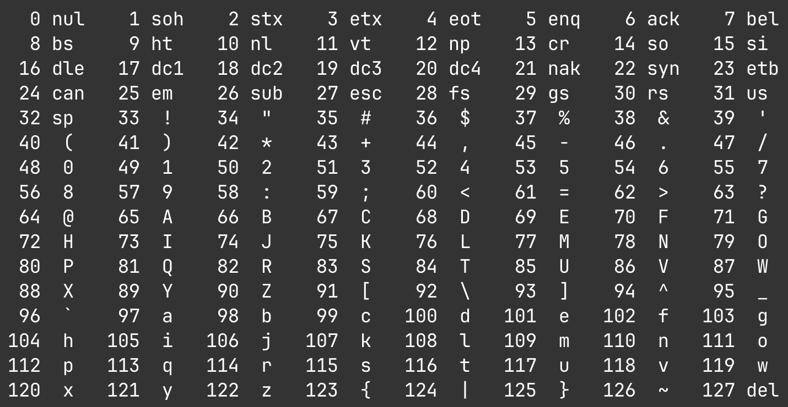
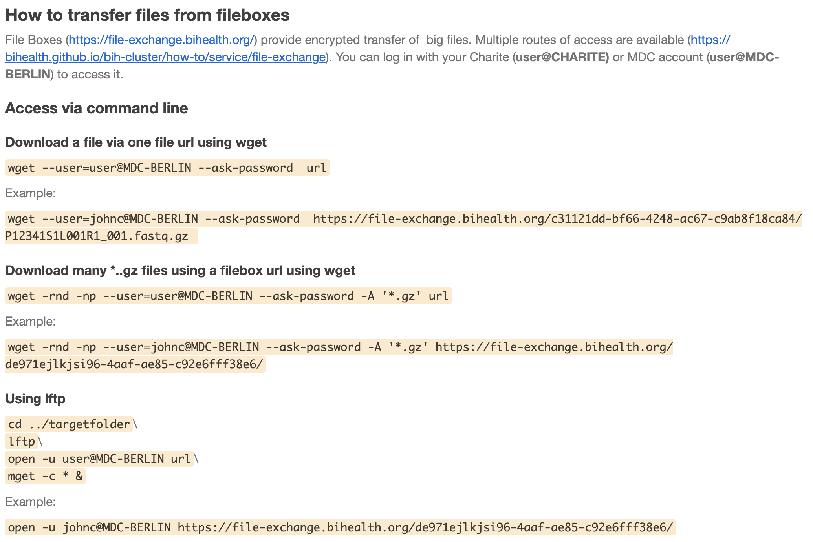

2026-09-11 class
===

Today we'll talk about and work on sequence data.

* FASTA files
* FASTQ files
    * What is the quality string?
    * Paired-end reads
* Sequencing read trimming and quality
* Editing text files
* Speed on the command line

FASTA
===

This is a very simple format, giving IDs and nucleotide (or amino acid) sequences:

```
>AB116084.1 Hepatitis B virus DNA (HBV-BAN81)
TTCCACAGCTTTCCACCAAGCCCTGCAAGATCCCAGAGTCAGGGG
CCTGTATTTTCCTGCTGGTGGCTCC
>X75657.1 Human hepatitis virus (genotype E, Bas)
TTCCACAACATTCCACCAAGCTCTG
CAGGATCCCAGAGTAAGAGG
GGTCAACTTTGACTGccAT
```

Sequences don't have to be the same length. Sequences may span
multiple lines. IDs might be duplicated. There might be ambiguous
codes (e.g. `W` can mean `A` or `T`. See
https://en.wikipedia.org/wiki/Nucleic_acid_notation)

FASTQ
===

A more complicated format, giving IDs, nucleotide sequences, and a
"PHRED" quality score per nucleotide. FASTQ are produced from
sequencer output, in which the sequencer infers each nucleotide. It
provides well-calibrated estimates of nucleotide "call" accuracy.

Here's an example FASTQ record for a single read:

```
@HWI-D00230L:378:CAGUJANXX:2:2116:14396:83860
TCTTTCGGAGTGTGGATTCGCACTCCTCCAGCATATAGAT
+
CBCBBGGG/CF1EE<;FFG@<CEGGGGBGGGGGG>FGFD?
```

As with FASTA, sequences may differ in length, may span multiple
lines, and IDs might be duplicated. The ID can optionally be repeated
after the `+` (see Wikipedia).

Ambiguous codes are rarely used. The sequencer makes its best guess and
gives you a quality score.

FASTQ has a low-frequency bad gotcha: the first character on a line of
quality scores can be a `@`, which looks like the start of the next read!

PHRED quality scores
===

```
@HWI-D00230L:378:CAGUJANXX:2:2116:14396:83860
TCTTTCGGAGTGTGGATTCGCACTCCTCCAGCATATAGAT
+
CBCBBGGG/CF1EE<;FFG@<CEGGGGBGGGGGG>FGFD?
```

The quality score for each nucleotide "call" is `-10` times the (base
10) logarithm of the probability the sequencer estimates it has made a
mistake (converted to a natural number). Sounds complicated, but is
actually simple. See https://www.desmos.com/calculator/r4lawpiq4n

# Example: the ? in the above FASTQ record

Suppose the sequencer estimates the probability it has made a wrong
nucleotide "call" as 1/1000. This is 10^-3. The quality
score will be this times `-10`. I.e., `30`.

The 30 is then added to 33. The 33 corresponds to `!`, which is the
first printing character in the ASCII code. This gives 63, which is
the ASCII value for `?` (see `man ascii`).

<!--
Going the other way:
10 ^ ((63 - 33) / -10) is 10 ^ -3 = 0.001
-->

This quality encoding scheme is sometimes also called `PHRED+33`.

# In summary

The nucleotide quality scores for a read sequence are given as a
compact character string encoding the estimated per-nucleotide error
probabilities.

See https://en.wikipedia.org/wiki/Phred_quality_score

ASCII
===

From `man ascii`



Sources of FASTA data
===

* NCBI

Sources of FASTQ data
===

<!-- column_layout: [1, 2] -->

<!-- column: 0 -->

* Charite filebox URL (retrieve with `lftp`). `pixi add lftp`
* SRA download
* Sequencing download

<!-- column: 1 -->



<!-- reset_layout -->

NGS pipeline
===

# Preliminary steps

* Make an index from some reference sequences
* Get the sequencing data

# Processing the NGS data

* Demultiplex (if necessary) to obtain FASTQ "reads"
* Look at the quality report - did the sequencing work ok?
* Trim the reads
* Align the reads to the references
* Examine the results

Today we will trim and look at quality.

Also: keep in mind my comment from last week that there are often many
programs for each possible step.

Trimming reads
===

We will use `fastp` (see https://github.com/OpenGene/fastp).

Install it:

```bash
$ pixi add fastp
✔ Added fastp >=1.3.6,<2
```

Then make yourself a new shell and confirm that `fastp` is installed and found:

```bash
pixi shell
fastp --help
```

The `--help` option produces a lot of output. You can see it a page at
a time via:

```bash
fastp --help | less
```

Some FASTQ data to work on
===

I've made a `data` directory in our shared storage area, and in that a
sub-directory called `fastq`:

```bash
$ cd /sc-projects/sc-proj-cc11-civclub/data
$ ls -lh
total 11624
-rwxrwxr--+ 1 jonestc posix-nogroup 425K Sep 10 20:58 sample_1_R1_001.fastq.gz
-rwxrwxr--+ 1 jonestc posix-nogroup 417K Sep 10 20:58 sample_1_R2_001.fastq.gz
-rwxrwxr--+ 1 jonestc posix-nogroup 4.3M Sep 10 20:58 sample_2_R1_001.fastq.gz
-rwxrwxr--+ 1 jonestc posix-nogroup 4.2M Sep 10 20:58 sample_2_R2_001.fastq.gz
```

What is the .gz suffix on those file names?
===

The `.gz` indicates that the file is compressed with `gzip`.

* `gzip` can be used to compress a file (this adds the `.gz` suffix)
* `gunzip` will uncompress a file

There are many compression programs. E.g., `zip` (installed by
default, uses a `.zip` suffix) and `bzip` (install with `pixi add
bzip2`; uses a `.bz2` suffix)).

**Importantly**: `gzip` and `gunzip` read from "standard input" and
write to "standard output" if you don't specify files for them to work
on.

```bash
# Print the first 8 lines of sample_1_R1_001.fastq.gz
$ gunzip < sample_1_R1_001.fastq.gz | head -n 8
```

Notice that the file is still compressed on disk.

```bash
# How many bytes (characters) is sample_2_R1_001.fastq.gz 
# when uncompressed?
$ gunzip < sample_2_R1_001.fastq.gz | wc -c
27511492
```

```bash
# How many reads does sample_2_R1_001.fastq.gz contain?
# Caution: remember what I said about FASTQ having a gotcha!
$ gunzip < sample_2_R1_001.fastq.gz | egrep -c '^@'
100000
```

Running fastp
===

The following works for me because I have a symbolic link in my home
directory (`~`) called `data` that points to
`/sc-projects/sc-proj-cc11-civclub/data`:

```bash
$ mkdir 20260911-ngs-intro
$ cd 20260911-ngs-intro

$ time fastp \
    -i ~/data/fastq/sample_1_R1_001.fastq.gz \
    -I ~/data/fastq/sample_1_R2_001.fastq.gz \
    -o sample_1_R1-trimmed.fastq.gz \
    -O sample_1_R2-trimmed.fastq.gz \
    -j sample_1.json \
    -h sample_1.html
```

Text editing
===

`nano` is working quite well for me now. I changed to a dark theme in
Jupyter because the default highlighting looked bad with the light
theme.

But... you can also edit files using the Jupyter interface (i.e., not
from the shell using `nano`).

If you're getting the impression that I don't know much about using
Jupyter Hub, you're right!  Please explore, learn, and help us all to
improve.

Command-line speed
===

As I mentioned, you _really_ need to learn some command line shortcuts
to massively increase the speed at which you can do things.

You may need to change the Terminal settings to make the `Option` key
work like `Alt` (for those on a Mac, and maybe others?), as used in
the following list:

* Control-a takes you to the beginning of the line
* Control-e takes you to the end of the line
* Control-r incremental reverse search of your command history
* Control-y yank back killed (deleted text)
* Alt-. insert the last word from the previous command
* Control-k kill (delete) the characters to the end of the line

* Control-f move forward one character
* Alt-f move forward one word

* Control-b move backward one character
* Alt-b move backward one word

* Control-d delete one character
* Alt-d delete one word (after the cursor)
* Alt-backspace delete the word before the cursor


<!--
Local Variables:
indent-tabs-mode: nil
End:
-->
