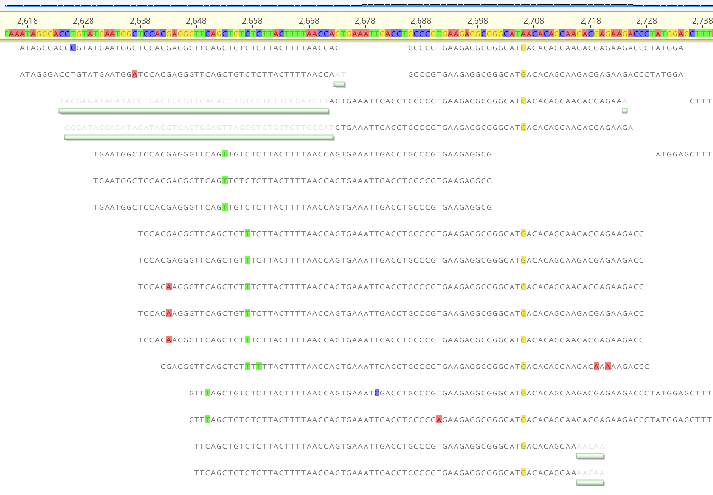
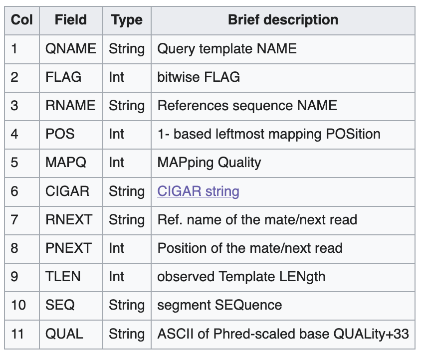
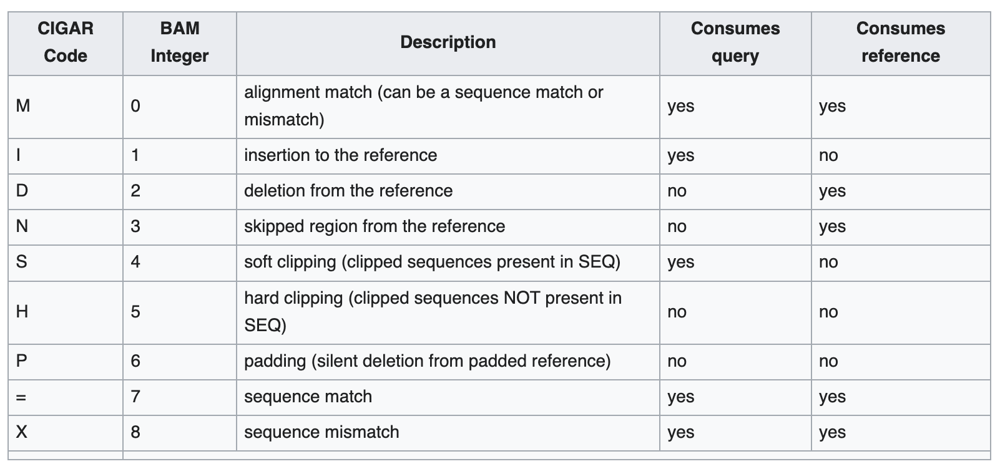

2026-09-18 class
===

Last week we took some raw FASTQ files and trimmed adapters from them
using `fastp`.

Who is actually doing anything on the cluster between classes?

Today we'll learn how to "map" the reads to references. "Mapping" is
also often called "aligning".



Starting from trimmed FASTQ
===

Now that you've trimmed adapters from your FASTQ, what do you do next?

You likely want to align them against a reference sequence (or
sequences). That's what I think people do in Geneious when they ask us
if they can have the raw reads for a sequencing run.

# Mapping programs

* bowtie2
* bwa
* minimap2

And there are others!

Install bowtie2
===

```bash
$ cd ~/workspace  # Or wherever you have pixi.
$ pixi add bowtie2
$ pixi shell
$ bowtie2 --help  # Should produce a bunch of output.
```

Let's work in a new directory
===

```bash
$ mkdir 20260918-map
$ cd 20260918-map
```

Make a bowtie2 index
===

```bash
$ bowtie2-build --help  # Have read of this (pipe the output to less).
$ bowtie2-build ~/data/references/HBV-G.fasta HBV

# The above command produces the below files.
$ ls -l
total 768
-rw-r--r-- 1 jonestc posix-nogroup 4195559 Sep 17 22:01 HBV.1.bt2
-rw-r--r-- 1 jonestc posix-nogroup     816 Sep 17 22:01 HBV.2.bt2
-rw-r--r-- 1 jonestc posix-nogroup      17 Sep 17 22:01 HBV.3.bt2
-rw-r--r-- 1 jonestc posix-nogroup     812 Sep 17 22:01 HBV.4.bt2
-rw-r--r-- 1 jonestc posix-nogroup 4195559 Sep 17 22:01 HBV.rev.1.bt2
-rw-r--r-- 1 jonestc posix-nogroup     816 Sep 17 22:01 HBV.rev.2.bt2
```

Some Hepatitis B virus FASTQ
===

I put some HBV FASTQ data into the stored area:

```bash
# Remember, I have a symlink in '~/data' that points to
# /sc-projects/sc-proj-cc11-civclub/club-club/data/fastq

$ ls -la ~/data/fastq/HBV_*
-rwxrwxr--+ 1 jonestc posix-nogroup  29415281 Sep 17 21:14 HBV_RISE718_R1_trimmed.fastq.gz
-rwxrwxr--+ 1 jonestc posix-nogroup  29693520 Sep 17 21:14 HBV_RISE718_R2_trimmed.fastq.gz
-rw-r--r--  1 jonestc posix-nogroup 228117891 Sep 17 22:32 HBV_RISE718_single_trimmed.fastq.gz
```

The `R1` and `R2` files each have 1,000,000 reads.

How do we see how many reads are in
`HBV_RISE718_single_trimmed.fastq.gz`?  (answer: 5,494,312)

If you want more data, see

```bash
$ ls LV7008876184-LV7008414499-CGG2015787_S1_L002_*.fastq.gz
LV7008876184-LV7008414499-CGG2015787_S1_L002_R1_001-ar3.fastq.gz
LV7008876184-LV7008414499-CGG2015787_S1_L002_R2_001-ar3.fastq.gz
```

These files are both 8GB and each contains 282,894,963 reads.
I.e. 0.56 billion reads in total.

Map reads with bowtie2
===

```bash
$ bowtie2 --local --xeq --no-unal -x HBV \
    -1 ~/data/fastq/HBV_RISE718_R1_trimmed.fastq.gz \
    -2 ~/data/fastq/HBV_RISE718_R2_trimmed.fastq.gz \
    > matches-local-without-single.sam
```

This takes about 8 seconds.

Or if you want a few more matches, include the unpaired reads (using `-U`):

```bash
$ bowtie2 --local --xeq --no-unal -x HBV \
    -1 ~/data/fastq/HBV_RISE718_R1_trimmed.fastq.gz \
    -2 ~/data/fastq/HBV_RISE718_R2_trimmed.fastq.gz \
    -U ~/data/fastq/HBV_RISE718_single_trimmed.fastq.gz \
    > matches-local-with-single.sam
```

Which takes about 40 seconds.

About those bowtie2 options
===

* `--local`: Allow local (i.e., within-read) matches as opposed to
    end-to-end in which the whole read must match. When you use local
    matching, read ends can be "soft clipped" (i.e., marked in the
    CIGAR string as not matching). With the bowtie2 default
    (end-to-end matching) this is not allowed.

* `--xeq`: Use `X` and `=` in the CIGAR string, instead of just `M`.

* `--no-unal`: Don't output anything for reads that don't align

* `-x HBV`: Specifies the bowtie2 index to map reads against.

SAM files
===

bowtie2 produces SAM output. See https://en.wikipedia.org/wiki/SAM_(file_format)

SAM files are TSV (TAB-separated values). There's a lot of interesting
information in there, and it helps to know how to interpret it.

# SAM file fields

These are the mandatory first 11 fields



There can be many more fields and they also have valuable information.


Look at the results
===

SAM format is just a text file, so we can use all our normal tools to
work with it:

```bash
$ less matches-local-with-single.sam
```
Command line(s), version, name and length of reference(s), as well as
all the matches.

It's extremely easy to pull fields out of TSV files with `cut`:

```bash
$ cut -f6 matches-local-with-single.sam

# More useful (skip SAM header lines):
$ egrep -v '^@' matches-local-with-single.sam | cut -f6
```

Queen Felicity Rarely Plays Multi-dimensional Chess!
===

The "CIGAR" string (field #6 in the SAM output) tells you about the matches.

See https://en.wikipedia.org/wiki/List_of_mnemonics#Biology

And https://en.wikipedia.org/wiki/Sequence_alignment#Representations



The format is just concatenated repeats of COUNT CODE. For example: `1S22=1X13=2X30=3S`.

Install samtools
===

`samtools` can be used to work with SAM (and BAM - the small/fast binary format of SAM):

```bash
$ pixi add samtools
```

This gives you various useful commands:

```bash
$ samtools --help | less

$ samtools view -c matches-local-with-single.sam
26

# Extract the FASTQ
$ samtools fastq matches-local-with-single.sam > matches.fastq
# Same thing, but compressed:
$ samtools fastq matches-local-with-single.sam | gzip > matches.fastq.gz

$ samtools flags

# Make a BAM file from a SAM
$ samtools view -b -h matches-local-with-single.sam > matches-local-with-single.bam
$ samtools sort matches-local-with-single.bam > matches-local-with-single-sorted.bam
$ samtools index matches-local-with-single-sorted.bam
```


<!--
Local Variables:
indent-tabs-mode: nil
End:
-->
