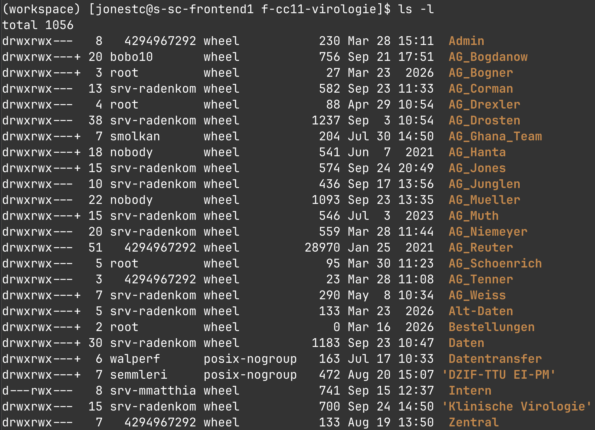
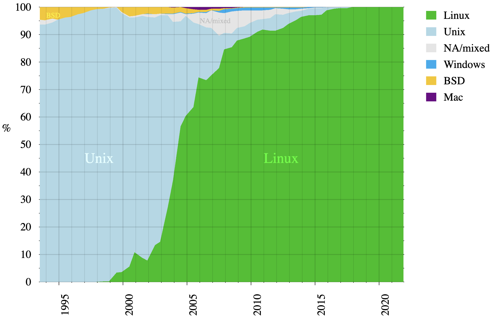
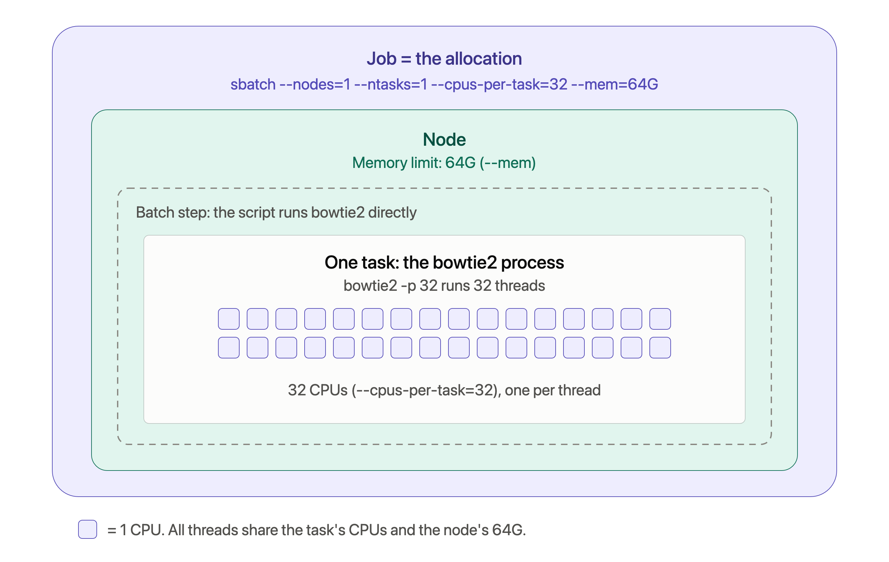
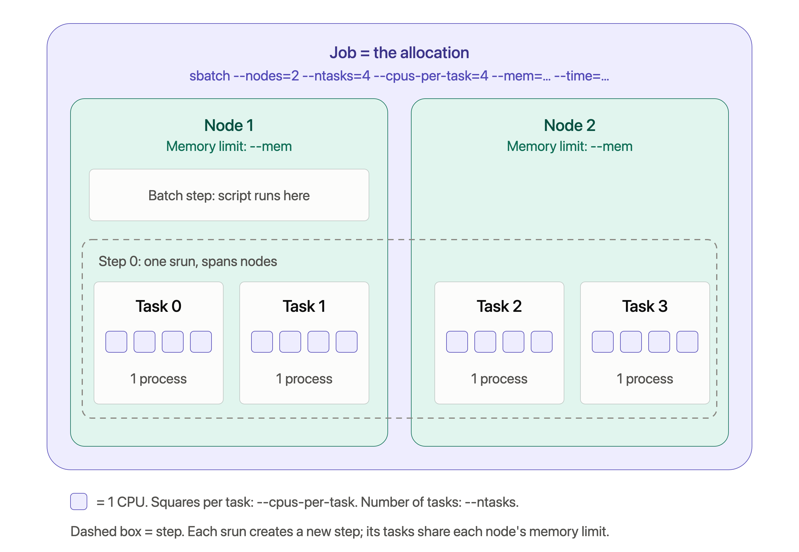

2026-09-24 class
===

Last week we learned

* How to build a bowtie2 "index".
* How to "map" FASTQ files against that index.
* About the contents of the resulting SAM file.

Today we'll learn how to do that at scale on a `Slurm` cluster.

But first
===

Public service announcement

# Transferring files to/from the cluster

Till figured out that on the cluster you can access the Charité S
drive as follows:

```bash
$ cd /charite-store-f/f-cc11-virologie/
```



Slurm
===

The Simple Linux Utility for Resource Management.

1. Allocates access to compute "nodes" to users for some duration.
2. Provides a framework for starting, executing, and monitoring work on allocated nodes.
3. Arbitrates contention for resources by managing a queue of pending jobs.

Adapted from https://en.wikipedia.org/wiki/Slurm_Workload_Manager

High-performance compute system (HPCS)
===

Also known as a "cluster", an HPCS is a collection of (often diverse)
computer "nodes" and with shared disk space, connected by a fast
network, and centrally managed.

# login and compute nodes

The nodes are of two types, `login` and `compute`:

* When you connect via `ssh` you will be on a login node. You're not
  supposed to do (and often are prevented from doing) much on these
  nodes.  You use login nodes to obtain access to the compute nodes.
* Compute nodes typically have many CPUs and large amounts of RAM. The
  vocabulary around compute nodes is unfortunately (necessarily) a bit
  complicated. Today we will try to keep things simple.

When you connect via a Juypter, you are assigned a compute node.

# A scheduler

There will typically be many other users trying to use the HPCS

So, if you log in to a busy cluster, it will often be the case that
all the nodes in the cluster are already running jobs for other
people. And there may be many jobs already queued up waiting to run.

The "scheduler" (a program) takes care of managing resources.

The Slurm scheduler is very complicated!

Today
===

We'll learn something about using Slurm.

This is a core reason for you attending this course.

Slurm is running on the majority of the top 500 HPCS systems.

So what you learn here should be applicable wherever you wind up (at
least if you're in academia). The BIH cluster also runs Slurm.

Linux runs on _all_ of the top 500 HPCS systems.

Note that there are scheduling systems other than Slurm and there are
also powerful single computers that can be accessed with no need to
use a scheduler.  In a future class we could also learn how you can
access cloud compute systems (e.g., Amazon EC2).



A little about the Charité cluster
===

You can use the `sinfo` command to get a summary of the nodes in the
cluster.

```bash
$ sinfo -o "%P %N %c %m"
PARTITION   NODELIST                           CPUS   MEMORY
compute*    s-sc-node[002-044]                 64+     504811+
gpu         s-sc-gpu[002-029]                  64      504811
pgpu        s-sc-dgx01,s-sc-pgpu[01-08,11-16]  64+     504811+
agpu        s-sc-agpu001                       64     1030000
```

Note that I added some whitespace padding to the output above.

Use `sinfo -N -o "%P %N %c %m" | less` if you want to see a line of
output for each node.

Nodes are divided into "partitions".

See `man sinfo` (and other manual pages!) for more detail.

And https://slurm.schedmd.com/documentation.html is very useful, as is
Claude.

Getting compute nodes
===

You will typically want to do one of two things:

* Get a shell so you can interactively run a series of commands on a
  node with lots of memory and/or CPUs.
* Run a certain command (or commands) that you know will require lots
  of memory and/or CPUs.

These two have much in common.

The main difference is that in the first, you wait for the Slurm
allocation, then type commands. Every command you type will be run on
the node with all the resources available. You don't need to know in
advance exactly what you're going to want/need to do.

In the second, you already know the commands you want to run and you
submit them to Slurm and it takes care of running them.

You can use the first approach to do the second, but if you do it the
first way you will need to sit around waiting for the compute node to
become available. That could take hours or even days, depending on
what you're requesting.

We'll look at both.

Let's look around a bit
===

First of all, let's look around a bit. You can use `nproc` to see how
many "cores" are available to you (a "thread" of execution can run on
each core). Also look at the environment variable `SLURM_MEM_PER_NODE`
and at your host name.

After I log in, I see this:

```bash
$ nproc
16

# This doesn't show anything as I'm not on a compute node so the
# variable isn't set.
$ echo $SLURM_MEM_PER_NODE


$ hostname
s-sc-frontend1
```

You will see something different if you do this in Jupyter because you're
already on a compute node.

Getting a shell interactively
===

Now get a shell (`bash`) for ten minutes on a compute node:

```bash
# Ask for 4 Gb of RAM and 8 cores for 10 minutes, running bash
$ srun --pty --mem 4G --cpus-per-task 8 --time 10:00 /bin/bash -i

# You're now on a compute node (your host name likely differs)
$ hostname
s-sc-node011

# And you have 8 cores.
$ nproc
8

$ echo $SLURM_MEM_PER_NODE
4096

$ exit  # Or type control-d
```

And you're back on your original node. Try `man srun` for more info.

```bash
# For fun, ask for 512 Gb of RAM & 64 cores (for 10 seconds).
$ srun --pty --mem 512G --cpus-per-task 64 --time 00:00:10 bash -i
```

Submit a job with sbatch
===

Put this in a file called `date.sh`:

```
#!/bin/bash

#SBATCH --nodes=1
#SBATCH --ntasks=1
#SBATCH --cpus-per-task=4
#SBATCH --time=2:00

sleep 30
date
```

Then hand it to the Slurm scheduler using the `sbatch` command

```bash
$ sbatch date.sh
Submitted batch job 10906138

$ squeue -u $USER
JOBID    PARTITION  NAME     USER     ST  TIME  NODES   NODELIST(REASON)
10906138 compute    date.sh  jonestc  R   0:01      1   s-sc-node004
          
$ ls -l
-rw-r--r-- 1 jonestc posix-nogroup 110 Sep 24 22:00 date.sh
-rw-r--r-- 1 jonestc posix-nogroup  33 Sep 24 21:59 slurm-10906138.out
```

sbatch --wrap is very useful
===

You can use `--wrap` to give your commands to `sbatch` on the command line:

```bash
$ sbatch --mem 4G --cpus-per-task 8 --time 00:00:10 --wrap date
```

Or a command that has to be run using Pixi:

```bash
$ sbatch --mem 4G --cpus-per-task 8 --time 1-00:00:00 --wrap 'pixi run bowtie2 ...'
```

A necessary evil
===

(And pain in the butt)

You need to estimate in advance how much memory your job will need,
how many cores will be a good number, and how long the job will take.

It can be hard to do this, and sometimes frustrating!

Get a node to run `bash`, but just for 10 seconds:

```bash
srun --pty --mem 4G --cpus-per-task 8 --time 00:00:10 bash -i
```

Shortly afterwards...

```
[2026-09-25T01:48:04.004] error: *** STEP 10907405.0 ON s-sc-node008 CANCELLED AT 2026-09-25T01:48:04 DUE TO TIME LIMIT ***
srun: Job step aborted: Waiting up to 32 seconds for job step to finish.
```

**Note:** some long-running commands can save a periodic status file.
This allows them to be restarted if your job exceeds the amount of
time you allocated for it.

Slurm terminology - keeping it as simple as possible
===

If you just want to run one process on one node and only specify the
memory and number of cores, you don't need to learn many terms or
command-line arguments.



Slurm terminology - more detail
===

If you want to do something more complex, the terminology can be quite
confusing. Claude can explain it pretty well, though, if you keep on
asking questions and for clarifications.



Let's do some real work
===

Here's how you could run the `bowtie2` command from last week using
Slurm, requesting 16 Gb of RAM and 32 cores on a node for one hour.

```bash
$ cat bowtie2-submit.sh
#!/bin/bash

#SBATCH --cpus-per-task=32
#SBATCH --time=1:00:00
#SBATCH --mem=16G

# You can get into a pixi shell like this (for all commands)
# eval "$(pixi shell-hook --manifest-path ~/workspace/pixi.toml --shell bash)"

# Or just use 'pixi run' before your commands.
pixi run bowtie2 \
    --threads $SLURM_CPUS_PER_TASK \
    --local --xeq --no-unal -x ../20260918-map/HBV \
    -1 ~/data/fastq/HBV_RISE718_R1_trimmed.fastq.gz \
    -2 ~/data/fastq/HBV_RISE718_R2_trimmed.fastq.gz \
    -U ~/data/fastq/HBV_RISE718_single_trimmed.fastq.gz \
    > matches-local-with-single.sam
    
# Then give it to sbatch to schedule the job:
$ sbatch bowtie2-submit.sh
Submitted batch job 10907434
```

Note that my `bowtie2` HBV database is in `../20260918-map/HBV`. Yours
will almost certainly be somewhere else, so you'll need to adjust the `-x`
argument in the above.

Even more fun
===

And here's a run on the 0.5 billion reads:

```bash
$ cat bowtie2-big-submit.sh
#!/bin/bash

#SBATCH --cpus-per-task=64
#SBATCH --time=12:00:00
#SBATCH --mem=128G

pixi run bowtie2 \
     --threads $SLURM_CPUS_PER_TASK \
    --local --xeq --no-unal -x ../20260918-map/HBV \
    -1 ~/data/fastq/LV7008876184-LV7008414499-CGG2015787_S1_L002_R1_001-ar3.fastq.gz \
    -2 ~/data/fastq/LV7008876184-LV7008414499-CGG2015787_S1_L002_R2_001-ar3.fastq.gz \
    > matches-local-big-FASTQ.sam
    
# Then give it to sbatch to schedule the job:
$ sbatch bowtie2-submit.sh
Submitted batch job 10906811
```

<!--
Local Variables:
indent-tabs-mode: nil
End:
-->
