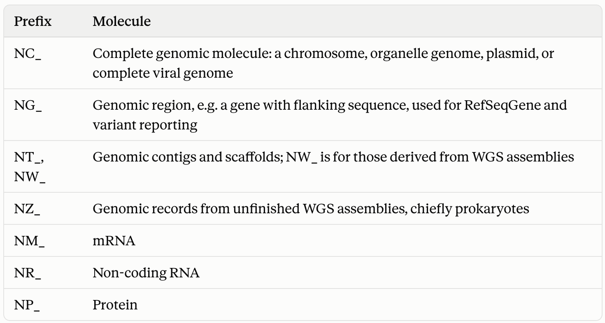

2026-10-02 class
===

Today we'll cover finding and downloading reference sequences.

Getting sequences
===

It's highly likely that you're going to want to obtain sequences for
whatever it is you're interested in. This will likely be because you
want to make phylogenetic trees, but of course there are other
reasons too.

So, where do you get sequences?

Primary nucleotide archives
===

# INSDC

the International Nucleotide Sequence Database Collaboration is comprised of

* `DDBJ`: DNA Data Bank of Japan.
* `EMBL-EBI`: European Bioinformatics Institute, part of the European
  Molecular Biology Laboratory (outside Cambridge, UK).
* `NCBI`: National Center for Biotechnology Information (US).

The INSDC has three levels of data:

* Raw reads. NCBI's SRA, the ENA read archive, and DDBJ's DRA.
* Assembled and annotated sequences. The "GenBank" records proper.
* Metadata. BioProject and BioSample, which link samples, projects,
  and runs.

These data are mirrored in all three centres. They also share a data
policy: anyone can use the data for anything, without restriction.


<!--

# Size

GenBank release 273.0 (15 August 2026) contains 60.07 trillion bases
in 6.68 billion records. About 8.2 Tbp of that sits in ~267 million
traditional records, and about 50.8 Tbp in ~5.1 billion WGS
records. So the headline number is dominated by whole-genome-shotgun
contigs, not hand-submitted entries. Growth has historically roughly
doubled every 18 months, though the rate has varied with sequencing
technology and submission practices.

SRA is far larger by volume. A 2025 paper reported more than 34.5
million submitted samples totalling over 107 petabases, or more than
38 petabytes of raw data. It is mirrored on Google Cloud and AWS, and
storage cost has become serious enough that NCBI now pushes SRA Lite,
which uses simplified quality scores. Quality scores are the dominant
storage cost.

-->


Outside INSDC
===

Don't assume a search of NCBI is comprehensive.

`GSA`: China's CNCB-NGDC Genome Sequence Archive (GSA) has become a major
repository. Its data don't automatically appear in GenBank or ENA.

`GISAID`: started for influenza in 2008 and became the dominant SARS-CoV-2
repository, with ~17.6 million sequences.

`Pathoplexus`: A fully-open alternative to GISAID launched in 2024. It syncs to
INSDC, and NCBI Virus and is a virus-specific view over GenBank and
RefSeq.

`BV-BRC`: Merged PATRIC, IRD, and ViPR. It adds consistent
re-annotation and analysis tooling on top of INSDC bacterial and viral
data.

---

There are also many curated organism-specific or community
resources, such as HBVdb, LANL's HIV database, and Nextstrain's
curated datasets.

INSDC curated and derived resources
===

The following datasets are derived from core INSDC assets. They are
not mirrored.

# RefSeq (NCBI)

Is a non-redundant, curated set of reference genomes, transcripts, and
proteins derived from INSDC data.
  
# Ensembl and Ensembl Genomes (EMBL-EBI)

Don't archive sequence. They take assemblies and run consistent
annotation pipelines on them: gene models, comparative genomics,
variation, and regulatory features. Ensembl covers vertebrates, and
Ensembl Genomes covers plants, fungi, protists, metazoa, and bacteria.
  
# UniProt (various)

Protein sequences and from three sources. `Swiss-Prot`, manually
curated and small, is maintained by the SIB Swiss Institute of
Bioinformatics (Geneva). `TrEMBL` mostly translated from INSDC coding
sequences, is automatically annotated and enormous (EBI). `PIR`, the
Protein Information Resource (Georgetown University Medical Center,
Washington DC)

RefSeq
===

RefSeq accession IDs start with two letters and then have an
underscore. The (unofficial) prefix meanings are



The first letter roughly separates curated or evidence-supported
records from computed ones:

`N`: These carry the main reference records. `N` can't be read simply
as "curated", though: many `NM_`/`NP_` records are generated by
automated pipelines. The record's status field tells you more than the
letter. `X`: The parallel `XM_`, `XR_`, and `XP_` records are model
predictions, mostly from NCBI's Gnomon gene-prediction pipeline. They
are replaced by `N` records if supporting evidence is reviewed.

Other letters. A few prefixes break the two-letter logic:

* `AC_` and `AP_` are complete genomic molecules and proteins from
  alternate assemblies.
* `YP_` is a protein record without a corresponding transcript record,
  typical of viral and organelle genomes.
* `WP_` is a non-redundant protein: one record per identical protein
  sequence across many prokaryotic genomes, rather than one per
  genome.
  
NCBI Virus
===

NCBI Virus is a portal over GenBank and RefSeq. Sequences keep their
GenBank or RefSeq accessions.

Consists of a specialised database holding sequence information from
the annotation pipeline alongside sample metadata in standardised
formats, plus a search interface and display tools. The valuable part
for most users is metadata normalisation.

Its `VADR` (Viral Annotation DefineR) classifies submitted sequences
against curated RefSeq models, then maps features from the matched
RefSeq via a covariance-model alignment of the full sequence. It's
built into GenBank's submission pipeline, so clean submissions are
accepted and annotated with no indexer involvement, and it's open
source for local use. Early versions excluded circular and segmented
genomes - still true?

VADR's annotation becomes part of the GenBank record and propagates
through INSDC, but the normalised metadata, the taxonomy grouping and
the interface stay at NCBI. If you pull the same accessions from ENA
you get the sequence and submitter annotation but not the tidied
metadata.

Download is available in bulk with filters applied, and there's API
and command-line access via NCBI Datasets. The SARS-CoV-2 Data Hub
extends the model to raw SRA runs. For virus work the main caveats are
that completeness is limited by what reaches INSDC — the GISAID and
GSA gaps apply — and that normalised metadata is only as good as the
submitter's original, so absent collection dates stay absent.

Using NCBI Virus command-line
===

Last night I discovered the
[NCBI datasets and dataformat](https://www.ncbi.nlm.nih.gov/datasets/docs/v2/command-line-tools/download-and-install/) tools.

Do this to install them (and `jq`):

```bash
$ pixi add ncbi-datasets-cli jq
```

Start reading here: https://www.ncbi.nlm.nih.gov/datasets/docs/v2/getting_started/


<!--
Local Variables:
indent-tabs-mode: nil
End:
-->
