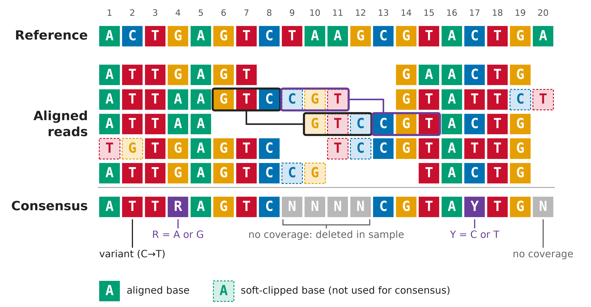

2026-10-09 class
===

Today we'll cover how to "call" a consensuses from a SAM/BAM file of
aligned reads.

# Context

Your sequencing reads (or other sequences, e.g., contigs from _de
novo_ assembly) have been aligned to a reference sequence by a tool
like `bowtie2` or `bwa`. The result is in a SAM/BAM file.  Now you
want to put together a summary "consensus" sequence that represents
what's in your data _vis a vis_ the reference sequence.

# Note

This is actually a really complicated subject.

* There is a lot of confusing terminology.
* A lot of alternate tools with names that can be misleading.
* Some tools can be used in various combinations.
* Some steps are optional.
* This is a situation where it's easy to screw up without realising it.
* The available tools are changing and new ones appear.

Claude (and ChatGPT, presumably) can help a lot!

The consensus sequence is a statistical summary
===

Especially with viral data, the idea that the genomes present in a
sample _all_ carry a "consensus" genome sequence is extremely
simplistic.

Or even that _any_ of them do.

This is pretty obvious but is almost never mentioned. So it can feel
like a widespread misconception, even though the idea of viral
quasispecies is well established.

# A consensus sequence is like a mean

There may be no virus particle containing the consensus sequence. Just
as with a set of numbers, the mean is not necessarily in the set.
E.g. `3, 4, 7, 10` have a mean of `6`, but `6` is not in the set.

A consensus sequence is also a form of summary statistic.

The above makes for a nice puzzle, BTW. As the size of a set of
numbers increases, what happens to the probability that their mean is
a member of the set?  (Given some assumptions / model.)

# You'll have to deal with variation in any case

Even outside the viral world, there will still frequently be variation
in your sequence data. This can arise from misincorporation errors
during PCR, multiple sources of error that can occur while sequencing,
contamination, etc.

The difficulty of consensus calling
===

Calling a consensus _can_ be trivial. But it can also be arbitrarily
difficult (i.e., up to and including impossible).

Remember that the consensus is a fiction. It may be impossible (and
wrong) to decide on an unambiguous single nucleotide call for a site
because in the underlying data there is not a single nucleotide, there
are several.

Indels make the situation _much_ more complicated.

Unfortunately, consensus calling programs do not give you much
information back. It would be very useful to receive a summary of the
evidence they found at each site, the IDs of the reads that mapped to
the site, etc.

Reference bias
===

Before you can begin to call a consensus, you have to align your reads
against some sequence (usually called a "reference").  The choice of
reference sequence can have a major impact on your eventual consensus.

It's important to remember that the reference may _not_ be
particularly close to what's in your data.

If the genomes in your sample differ sufficiently from the reference
in a region, no reads will map to that part of the reference. If you
then call a consensus from the resulting SAM file, you will
necessarily end up with a sub-optimal result.

# Does a consensus caller need the reference?

In theory, no.

If you have good coverage and not much variation, there's no real
reason a consensus caller needs the reference sequence. However, a
legitimate use of the reference can be to adjudicate between reads
with low coverage and similar quality - you may want to call in favour
of the reference base.

Something to be aware of: It is possible with some consensus callers
to tell it to use the reference if no reads map to a region. In
general this is probably a bad idea.

# When there is no coverage at all

Note that Geneious puts a `?` into consensus sequences for regions of
the reference with no matching reads. It is not clear whether your
organism does not have that region at all or whether you were unlucky
and molecules with sequences that do match the missing region were
simply not sequenced.

So how do you call a consensus?
===

The simplest thing to do is to proceed "site" by site (i.e., column by
column) through the reference genome positions. For each site you look
at the nucleotide calls (the bases _and_ their qualities) and "call" a
decision. The sequence of calls gives you a consensus sequence.

Remember: the reference length is in the SAM/BAM file header, but its
sequence is not.

# Obvious and not-so-obvious considerations

* What read "depth" will you require, at minimum, to make a call at a site?
* What should be put into consensus for reference regions with no matching reads?
* What homogeneity threshold(s) will you use?
* Do you want ambiguous nucleotide codes in your consensus?
* How should nucleotide quality scores influence the calling?
* You should use a `ploidy` of 1, if that is an option on the tools you choose.
* If you're interested in minor variants, all such information is gone
  from a consensus sequence.

# IUPAC ambiguous nucleotide codes
```
    M: AC       V: ACG 
    R: AG       H: ACT 
    W: AT       D: AGT 
    S: GC       B: CGT 
    K: GT
    Y: CT       N: ACGT
```

IUPAC = International Union of Pure and Applied Chemistry (https://iupac.org/)

An example (ignoring quality)
===



This image was made by Claude (see
`slides/20261009-consensuses/make_consensus_figure.py`)

How Geneious does it
===

[The below is Claude's summary of the Geneious per-site approach]

With a percentage threshold, each column is a plain vote. The most
frequent residues are taken until their combined fraction of the rows
reaches the threshold, and if that takes more than one base you get
the best-fit IUPAC code. IUPAC codes already in the reads count as
fractional support for each base they contain.

With Highest Quality, the vote is weighted by quality. Geneious sums
the quality scores supporting each candidate base and takes bases in
order until their share of the column’s total quality exceeds the
threshold (50%, 60% or 75%).

Worked example from the Geneious (2021) manual: A’s with quality 30
and 25, a G with 30, and a T with 15. The A’s hold 55 of the 100
total, which is below 60%, so A alone isn’t called. Adding the G
brings the share to 85%, so the call is R.

VCF format
===

If you read about consensus calling online, you're likely to run into
`VCF` (variant call format). This is a TAB-separated value (".tsv")
file format used to describe sequence variation (relative to a
reference).

See https://en.wikipedia.org/wiki/Variant_Call_Format

You can easily produce `VCF` from a SAM/BAM file:

```sh
$ pixi add bcftools
$ pixi shell

$ data=/sc-projects/sc-proj-cc11-civclub/club-club/data

# This produces over 200,000 lines of output.
$ bcftools mpileup \
    --fasta-ref $data/references/NC_055231.1.fasta \
    $data/bam/RISE254-mapped-to-NC_055231.1.bam \
    | less
```

Calling a consensus using bcftools
===

First: `pixi add bedtools samtools` (you should already have
`samtools` from an earlier class).

Then, a pipeline could look like this:

```sh
# 1. QC/adapter trim
$ fastp -i reads_1.fq.gz -I reads_2.fq.gz -o trimmed_1.fq.gz -O trimmed_2.fq.gz

# 2. Align
$ bowtie2 --no-unal --xeq -1 trimmed_1.fq.gz -2 trimmed_2.fq.gz \
    | samtools sort -o aligned.sorted.bam
$ samtools index aligned.sorted.bam

# 3. Variant call, haploid
$ bcftools mpileup -a AD,DP -f ref.fa aligned.sorted.bam \
  | bcftools call --ploidy 1 -mv -Oz -o calls.vcf.gz
$ bcftools index calls.vcf.gz

# 4. Filter based on depth and quality thresholds.
$ bcftools filter -e 'DP<10 || QUAL<20' calls.vcf.gz -Oz -o filtered.vcf.gz
$ bcftools index filtered.vcf.gz

# 5. Low-coverage mask
$ samtools depth -a trimmed.sorted.bam | awk '$3<10' \
  | awk '{print $1"\t"$2-1"\t"$2}' > lowcov.bed
$ bedtools merge -i lowcov.bed > lowcov.merged.bed

# 6. Make the consensus
$ bcftools consensus -f reference.fa -m lowcov.merged.bed filtered.vcf.gz \
  > consensus.fa
```

This is fine, but you won't get any ambiguous nucleotide calls!

Calling a consensus using samtools alone
===

Samtools can do the entire job. Note that you don't give it the
reference FASTA. I have never used this samtools sub-command and
wasn't even aware of it until about a month ago. It was introduced in
2022 and was changing into the middle of 2023.

```sh
$ samtools consensus --ambig ~/data/bam/RISE254-mapped-to-NC_055231.1.bam \
    > consensus.fasta
```

Run it as `samtools consensus` to see its many other options.

# Edited summary from Claude

This differs from the `bcftools consensus` approach: given a VCF,
apply variants to a reference. It computes a consensus directly from a
BAM using a Bayesian model derived from gap5, without needing genotype
calls or a reference-guided VCF workflow at all. Its stated use cases
are more assembly-polishing oriented: producing a potentially
heterozygous consensus from a BAM for refining assembly consensus
post-realignment, generating a reference-synchronised FASTA for
CRAM-embedded references, or as a fast alternative to something like
ivar consensus.

Recent development on it has focused on platform-specific tuning — a
-X/--config profile option distinguishing Illumina from PacBio-CCS
error profiles, and a mode that computes the consensus twice with
different parameters and merges the results for a better
false-negative/false-positive tradeoff.

So it’s the right tool when you want a fast, dependency-light
consensus straight off a BAM and don’t need the filtering flexibility
of a full variant-calling step first; it’s the wrong tool if you need
to apply population- or amplicon-specific filtering logic before
deciding what goes into the consensus, since it’s much more rigid and
lacks bcftools’s flexibility to filter first.

Calling a consensus using `samtools mpileup` and `ivar`
===

iVar can be used to call a consensus, based on "pileup" information
produced by `samtools`. See
https://andersen-lab.github.io/ivar/html/index.html for more on iVar.

This is the approach we currently use in the diagnostics pipeline.

# Install iVar

```sh
$ pixi add ivar
```

# The general usage pattern:

```sh
$ samtools mpileup OPTIONS matches.bam | ivar consensus OPTIONS
```

Run `samtools mpileup` by itself or `ivar consensus` by itself to see
the the various command-line options. Note that `samtools mpileup` does
_not_ generate VCF (though it used to).

Try `samtools mpileup | ivar` now
===

I put some sample data on the Charité cluster. Try this:

```sh
data=/sc-projects/sc-proj-cc11-civclub/club-club/data

samtools mpileup -d 0 -aa -A -B -Q 0 \
    --fasta-ref $data/references/NC_055231.1.fasta \
    $data/bam/mapped-to-NC_055231.1.bam \
    | ivar consensus -p consensus -q 20 -t 0.6 -m 5
```

The above command can be found in
`slides/20261009-consensuses/make_consensus.sh`.

# Notes

* iVar sometimes crashes.
* If you have a BAM/SAM file with reads aligned against multiple
  references, you *must* filter down to just the one you want with
  `samtools mpileup -r REF-NAME ...`, otherwise you'll get a crazy
  (long) result based on all sites in all references!


Upcoming classes
===

* The dark-matter tools.
* _de novo_ assembly.
* Protein-level matching.
* Making multiple-sequence alignments.
* Tree making.

<!--
Local Variables:
indent-tabs-mode: nil
End:
-->
